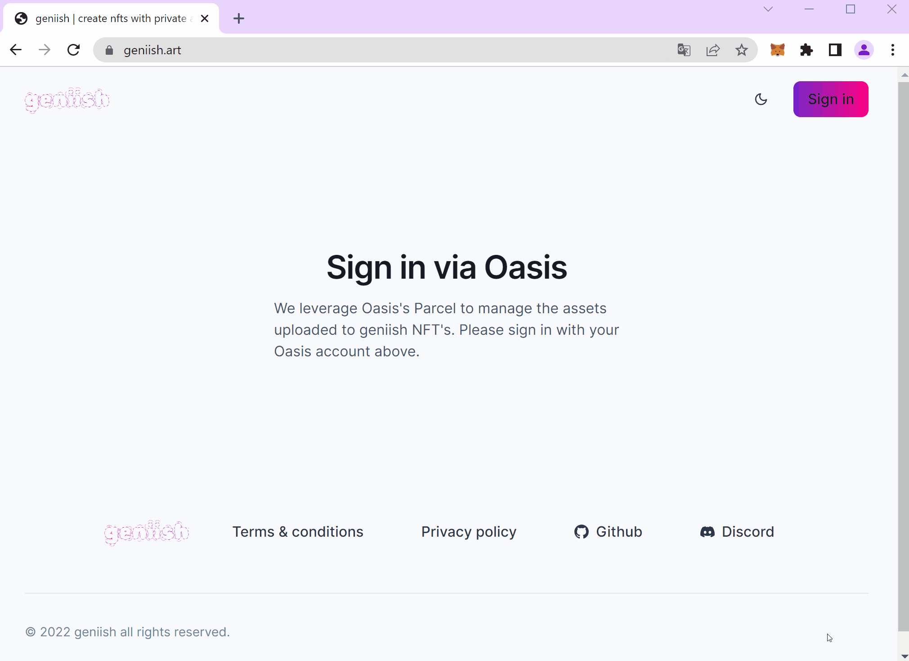
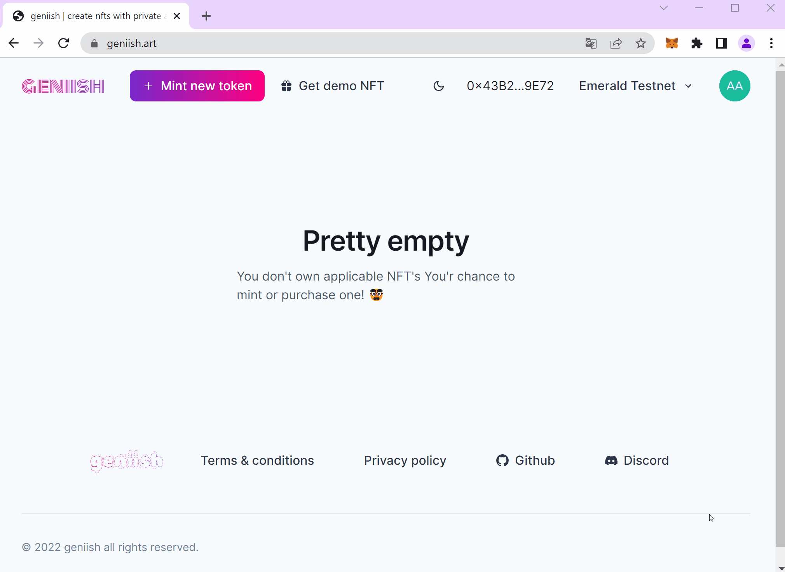

# Demo

Our short demonstration shows you how you can interact with private NFTs as a collector. This doesn't take longer than _five minutes_.

We set up multiple demo tokens with a pixelated preview image publicly viewable within the metadata. The full resolution image is saved as exclusive content on Parcel accessible via our dApp.

## Requirements

Make sure you have the following setup correctly.

- Metamask with Emerald Testnet configured (https://metamask.io/)
- Oasis account (https://steward.oasislabs.com/)

## Sign in on geniish

Go to our [dApp](https://geniish.io) and sign in with your Oasis Account and Metamask.

## Withdraw a demo token

We have prepared some demo tokens to play around with. You can withdraw one to your account immediately.

## Access the exclusive content

All demo tokens have the uncensored full-resolution version of the preview image attached as exclusive content. Unlock the token's documents to see that content.

## Conclusion

This short demonstration has shown how easy it is to interact with exclusive content. The current state is still prototyping and our MVL will include many more features. Find out more on our Roadmap and White paper.
